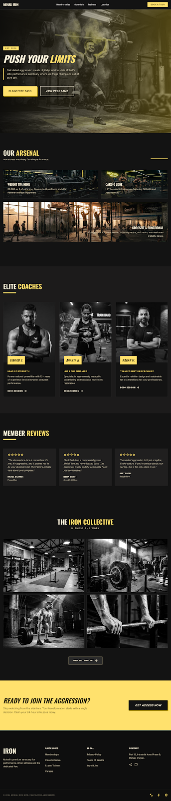

# Fitway Gym Website

<div align="center">
  
</div>

<div align="center">
  <strong>The official landing page for Fitway Gym located in Sahibzada Ajit Singh Nagar, Punjab.</strong>
</div>

<br />

<div align="center">
  <a href="#features">Features</a> •
  <a href="#tech-stack">Tech Stack</a> •
  <a href="#local-development">Local Development</a>
</div>

<br />

## 🏋️‍♂️ About
Fitway Gym is a premium fitness facility designed to push limits. This repository contains the source code for the landing page, crafted with a dynamic, brutalist, and modern aesthetic. It is fully responsive and optimized for conversions, featuring striking micro-animations, bold typography, and an automated Google Reviews showcase.

## ✨ Features
- **Responsive Design**: Flawless experience on mobile, tablet, and desktop.
- **Dynamic Marquee**: Smooth, auto-scrolling Google Reviews section.
- **Micro-Interactions**: Hover effects, scale transformations, and intersection observer fade-ins.
- **Modern Aesthetic**: High-contrast, brutalist design language with a customized Tailwind theme (`#d19e00` core color).
- **SEO Optimized**: Semantic HTML5 and performance-focused structure.

## 🛠 Tech Stack
This project is built using a lightweight but powerful stack:
- **HTML5**: Semantic structure.
- **Tailwind CSS**: Utility-first styling via CDN for rapid UI development and custom configurations.
- **Vanilla JavaScript**: Lightweight DOM manipulation, intersection observers, and event listeners.
- **Google Material Symbols**: For iconography.

## 🚀 Local Development

To run this project locally, simply clone the repository and serve the `code.html` file using any local web server.

```bash
# Clone the repository
git clone https://github.com/hvndal/fitway.git

# Navigate into the project
cd fitway

# Serve locally (Example using Python)
python -m http.server 8000

# Or using Node.js
npx http-server -p 8000
```
Open `http://localhost:8000/code.html` in your browser.

---

<div align="center">
  <i>Designed and developed for Fitway Gym.</i>
</div>


## 📂 Project Structure & Asset Management
This repository maintains a highly organized, professional file structure to ensure maintainability and scalability for production environments.

- `code.html`: The primary entry point containing semantic HTML5, embedded Tailwind CSS (via CDN for rapid deployment), and vanilla JavaScript logic.
- `assets/`: A curated directory of highly optimized, descriptive image assets. Files are named utilizing strict snake_case conventions (e.g., `strength_training_zone.jpg`) to ensure SEO compliance and professional auditability.

## 🛠️ Code Quality & Standards
- **Semantic HTML5**: Fully accessible markup structure.
- **BEM-style CSS Utility Classes**: Predictable styling architecture via Tailwind CSS.
- **Vanilla JavaScript**: Zero-dependency DOM manipulation for maximum performance and minimum footprint.
- **Responsive Design**: Mobile-first media queries ensuring a flawless experience on all devices.
