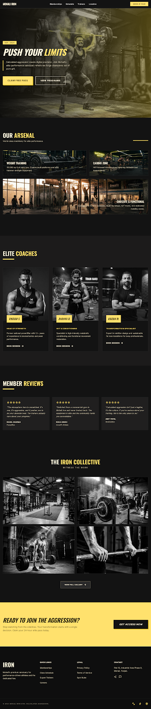

# Fitway Gym Website

<div align="center">
  
</div>

<div align="center">
  <strong>The official landing page for Fitway Gym located in Sahibzada Ajit Singh Nagar, Punjab.</strong>
</div>

<br />

<div align="center">
  <a href="#features">Features</a> •
  <a href="#tech-stack">Tech Stack</a> •
  <a href="#local-development">Local Development</a>
</div>

<br />

## 🏋️‍♂️ About
Fitway Gym is a premium fitness facility designed to push limits. This repository contains the source code for the landing page, crafted with a dynamic, brutalist, and modern aesthetic. It is fully responsive and optimized for conversions, featuring striking micro-animations, bold typography, and an automated Google Reviews showcase.

## ✨ Features
- **Responsive Design**: Flawless experience on mobile, tablet, and desktop.
- **Dynamic Marquee**: Smooth, auto-scrolling Google Reviews section.
- **Micro-Interactions**: Hover effects, scale transformations, and intersection observer fade-ins.
- **Modern Aesthetic**: High-contrast, brutalist design language with a customized Tailwind theme (`#d19e00` core color).
- **SEO Optimized**: Semantic HTML5 and performance-focused structure.

## 🛠 Tech Stack
This project is built using a lightweight but powerful stack:
- **HTML5**: Semantic structure.
- **Tailwind CSS**: Utility-first styling via CDN for rapid UI development and custom configurations.
- **Vanilla JavaScript**: Lightweight DOM manipulation, intersection observers, and event listeners.
- **Google Material Symbols**: For iconography.

## 🚀 Local Development & Production Domain

Production Domain: **[https://fitwaygym.in](https://fitwaygym.in)**

To run this project locally, clone the repository and serve the files using any local web server:

```bash
# Clone the repository
git clone https://github.com/hvndal/fitway.git

# Navigate into the project
cd fitway

# Serve locally (Example using Python)
python -m http.server 8000

# Or using Node.js
npx http-server -p 8000
```
Open `http://localhost:8000/index.html` in your browser.

---

<div align="center">
  <i>Official website for Fitway Gym • Sector 67, Mohali (<a href="https://fitwaygym.in">fitwaygym.in</a>)</i>
</div>

## 📂 Project Structure & Architecture

- `index.html`: The primary homepage featuring the high-impact hero, 6-discipline architectural grid, dynamic Google reviews, and Sector 67 geographic reach.
- `personal-training.html`: Dedicated 1-on-1 Personal Training with certified Pro Coaches, detailing structured periodization, nutrition guidance, and direct WhatsApp routing (+91-8146298024).
- `blog.html`: Fitness Hub containing authoritative training and nutrition guides for Mohali athletes.
- `404.html`: Custom branded not-found error page with navigation fallbacks.
- `CNAME`: Production domain configuration (`fitwaygym.in`).
- `assets/`: Optimized imagery, logo, and cached Google reviews (`assets/data/reviews.json`).
- `scripts/`: Automated Google Business Profile sync engine (`sync_google_reviews.js`).

## 🛠️ Code Quality & Standards
- **Semantic HTML5 & Schema.org**: Fully accessible markup with rich JSON-LD microdata.
- **Tailwind CSS & Motion.dev UX**: High-fashion brutalist typography, Lenis momentum scrolling, and spring physics.
- **Direct Conversion Actions**: International WhatsApp routing for Pro Trainer (+91 81462 98024) and Desk Support (+91 62396 13249).
